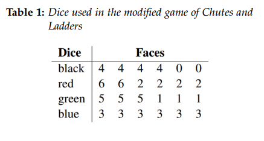
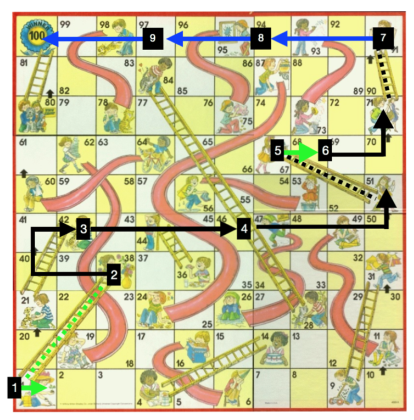

# Reinforcement-Learning-through-Dynamic-Programming
Applying Reinforcement Learning Algorithms to Play the Game of Chutes and Ladders Optimally 
## Reinforcement Learning
Reinforcement learning uses information that is provided on the level of correctness of the answer, but has no information on how to improve it. The process of learning occurs by trying out a number of different strategies and evaluating which strategies work best. Reinforcement learning is often described to have some agent and the environment that it interacts with. The agent is the one that is learning, while the environment is where the whole process of learning occurs. The environment, other than serving as the state space, also provides a reward. Reward, in turn, is the attribute that describes how good the strategy is and the agent tries to maximize the reward by taking different actions.
## Problem Domain
We tackle the problem of learning how to play a modified game of Chutes and Ladders optimally. The modified version of the game has four different types of die: black, red, green, and blue with different numbers on them (Table 1). On each move, the agent has a choice to select any one of the four dice and use the result of the roll for the action. Based on the numbers the dice have, the agent can opt to choose a die that has a higher probability of avoiding a chute or reaching a ladder square. The modified version is necessary because the
original version has no strategic element, since each move is dependent on a random number (1-6) from a spinner. The agent’s goal is to reach Square 100 (the final state) starting from Square 0 in the least number of turns.

## Dynamic Programming 
We use dynamic programming as an approach in finding the optimal strategy for playing the game. Dynamic programming allows us to tackle the problem off-line by breaking it down into simpler subproblems. The essence of dynamic programming is in the fact that we do not solve our subproblems repeatedly. Instead, we memorize their solutions for later use.
In an attempt to break our problem into subproblems, we first consider rolling dice of single color on each square for the whole game until we get to the final state. By rolling dice of the same color, we want to see how quick we get to the final square. We “memorize” the results that they produce. We also give a reward of -1 to our agent on every move that gets us closer to the target. We use the linear solver in MATLAB to compute the number of moves for each square on the board. The system of linear equations, in turn, is comprised of the values of probabilities of ending up at a certain state and the values of rewards. By solving the system of linear equations, we obtain the state values that converge to 0 as we get closer to the final state. Thus, state values indicate how quick we approach the final state. Then, we try rolling dice of different color at each stage and observe how the number of moves either increases or decreases and pick the optimal policy accordingly. If the number of moves is the smallest when we pick, for instance blue dice at a particular state, we then update our policy and opt to roll blue dice at that state. We keep updating our policy until we get the optimal one.
## Procedure
Our initial policies are pretty simple. We roll same colored dice throughout the entire game. Rolling blue dice all the time does not bring us to the final state because we are trapped in the infinite loop between square 47 and 26. We get to the final state in 38 moves if we choose to roll only black dice. Rolling green dice all the time yields 34 moves, while rolling red dice accounts for a slightly fewer 31 moves. We obtain our optimal policy by determining the smallest state value after a certain move. We keep track of the color of dice we roll along with the number of moves left to the final state. We record these state values from top to bottom not allowing the update of our policy to affect the earlier state values. Having tried rolling all four colors of dice at every state and keeping that color at the square that has the least number of moves left, we get our optimal policy that requires 9 moves to get to the final state.
Dynamic programming does not produce an efficient policy because it relies merely on probabilities to derive its optimal policy. In essence, dynamic approach bypasses the moves that have a larger number of steps because of lower probability.

